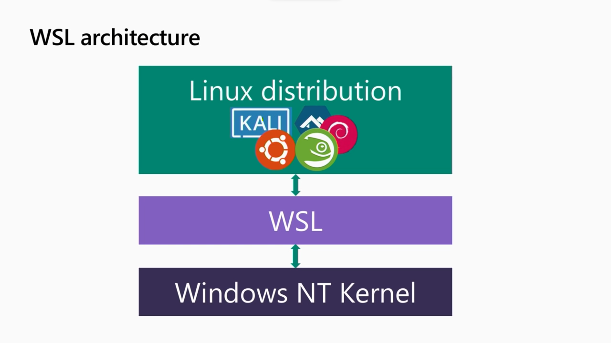
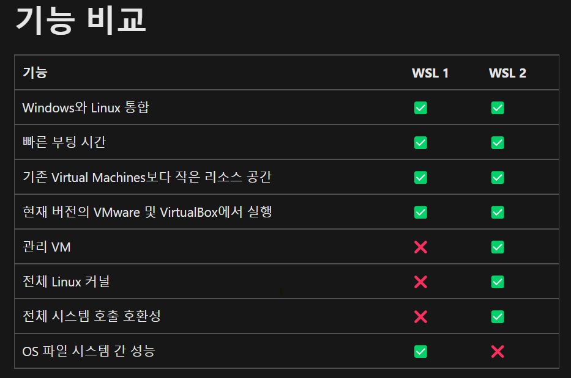

# WSL

- `Window` 에서 `Linux` 사용하려면 `Virtual Machine`과 같은 도구(Virtual Box, VMware 등)을 이용하여 듀얼 부팅 설정을 해야 했다.

> 하지만 필자는 듀얼부팅을 해서 사용하면 GPU 사용을 하지 않아서 인지 frame이 떨어지는것이 너무 싫었다ㅠㅠ

- 그래서 나온것이 `WSL(Window Subsystem for Linux)`이다.

- `WSL`은 `Hyper-V`기반의 경량화된 가상화 기술을 사용하여 실제 리눅스 커널을 탑재해 `Windows`운영체제에서 `Linux`운영체제를 구동할 수 있도록 해주는 기술이다.

- 그렇기 때문에 `GNU/Linux` 계열의 실행 파일인 `ELF(Executable and Linkable Format)`파일들을 실행 시킬수 있다.

## WSL1

- `WSL`은 두가지의 버전이 있는데 `WSL1`, `WSL2`버전이 존재한다.

- 기본적으로 `WSL1`, `WSL2`은 아키텍쳐 설계 자체가 다르다.

- `WSL1`은 `Window` 기반의 리눅스 인터페이스이지만, `WSL2`은 순수 리눅스 커널을 사용한다.

- `WSL1`은 `Linux Distribution(ubuntu,centos)`와 `Window Kernel`과 통신할 수 있는 `Linux-compatible Kernel Interface` 만들었다.

- `Linux Distribution`에서 리눅스 시스템콜을 하면 WSL은 `Window` 시스템 콜로 번역해서 실행한다.

 

- 하지만 그본적으로 `Linux Kernel`을 사용하지 않고 `Windows Kernel`을 사용하게 되는데 이러한 점은 `File IO`속도가 느리고 비효율적이라는 것이다.

- 또한 `Linux Kernel`에 종속적인 프로그램은 실행시킬수 없게 된다.

> 필자는 snap을 사용할려고 했을때 에러가 발생하는 경험이 있다.

## WSL2

- `WSL2`는 이러한 문제를 해결하고자 `Linux Kernel`을 가상화 하여 사용하는 설계로 변경하게 된다.

- 또한 가상화가 되면 가장 우려되는 점은 `Computing Resource`를 많이 잡아 먹는다는 것인데, 이런것을 고려하여 `Hyper-V`를 통해 최적화를 진행하였다.

> 하지만 디렉토리에 접근하는 속도는 WSL1 방식이 빠르다.

 

- `Hyper-V`위에 윈도우의 `NT Kernel`과 `Linux Kernel`이 병렬적으로 올라가서 실행된다는 것을 알 수 있다.

- 이러한 점으로 인해 `I/O Performance`가 3~6배 정도 빠르고, `Linux Kernel`에서 사용되는 `system Call`을 사용할수 있다.

- `WSL1` 과 `WLS2`의 기능 비교  

 

