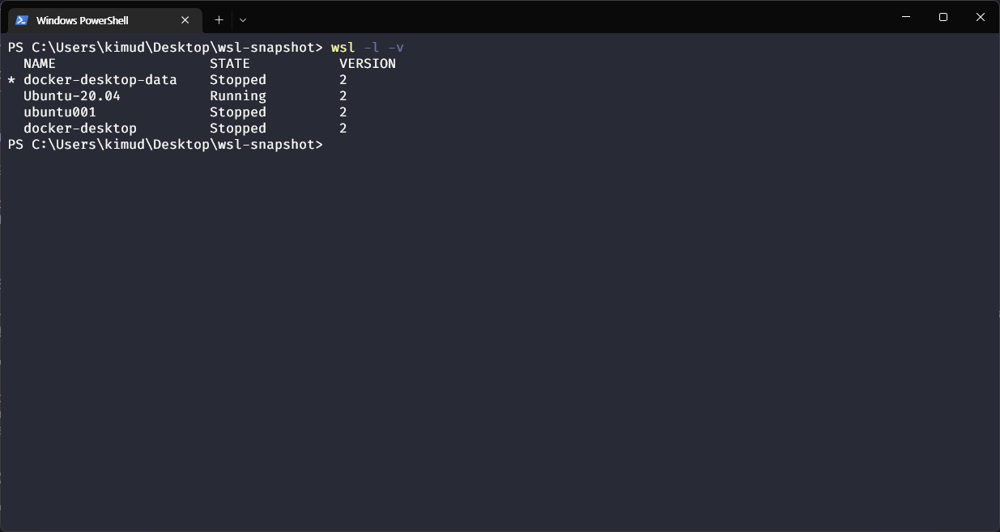

# WSL

<div style="display:flex;">
   &nbsp 
   &nbsp
   &nbsp
</div>

- `Window` 에서 `Linux` 사용하려면 `Virtual Machine`과 같은 도구(Virtual Box, VMware 등)을 이용하여 듀얼 부팅 설정을 해야 했다.

> 하지만 필자는 듀얼부팅을 해서 사용하면 GPU 사용을 하지 않아서 인지 frame이 떨어지는것이 너무 싫었다ㅠㅠ

- 그래서 나온것이 `WSL(Window Subsystem for Linux)`이다.

- `WSL`은 `Hyper-V`기반의 경량화된 가상화 기술을 사용하여 실제 리눅스 커널을 탑재해 `Windows`운영체제에서 `Linux`운영체제를 구동할 수 있도록 해주는 기술이다.

- 그렇기 때문에 `GNU/Linux` 계열의 실행 파일인 `ELF(Executable and Linkable Format)`파일들을 실행 시킬수 있다.

## WSL1

- `WSL`은 두가지의 버전이 있는데 `WSL1`, `WSL2`버전이 존재한다.

- 기본적으로 `WSL1`, `WSL2`은 아키텍쳐 설계 자체가 다르다.

- `WSL1`은 `Window` 기반의 리눅스 인터페이스이지만, `WSL2`은 순수 리눅스 커널을 사용한다.

- `WSL1`은 `Linux Distribution(ubuntu,centos)`와 `Window Kernel`과 통신할 수 있는 `Linux-compatible Kernel Interface` 만들었다.

- `Linux Distribution`에서 리눅스 시스템콜을 하면 WSL은 `Window` 시스템 콜로 번역해서 실행한다.

 

- 하지만 그본적으로 `Linux Kernel`을 사용하지 않고 `Windows Kernel`을 사용하게 되는데 이러한 점은 `File IO`속도가 느리고 비효율적이라는 것이다.

- 또한 `Linux Kernel`에 종속적인 프로그램은 실행시킬수 없게 된다.

> 필자는 snap을 사용할려고 했을때 에러가 발생하는 경험이 있다.

## WSL2

- `WSL2`는 이러한 문제를 해결하고자 `Linux Kernel`을 가상화 하여 사용하는 설계로 변경하게 된다.

- 또한 가상화가 되면 가장 우려되는 점은 `Computing Resource`를 많이 잡아 먹는다는 것인데, 이런것을 고려하여 `Hyper-V`를 통해 최적화를 진행하였다.

> 하지만 디렉토리에 접근하는 속도는 WSL1 방식이 빠르다.

 

- `Hyper-V`위에 윈도우의 `NT Kernel`과 `Linux Kernel`이 병렬적으로 올라가서 실행된다는 것을 알 수 있다.

- 이러한 점으로 인해 `I/O Performance`가 3~6배 정도 빠르고, `Linux Kernel`에서 사용되는 `system Call`을 사용할수 있다.

- `WSL1` 과 `WLS2`의 기능 비교  

 


## How to Access WSL2 File System 

- `WSL2`와 `Windows` 서로 디렉토리에 접근이 가능하다.

- 먼저 `WSL2`에서 `Windows` 디렉토리에 접근하는 원리를 살펴보도록 하자

 

- `File Server` 프로토콜인 `9P` 프로토콜을 통해 `WSL`에 윈도우 디렉토리를 마운트를 한다.

 

- `Windows`에서는 `WSL` 디렉토리 접근도 마찬가지 원리로 `9P` 프로토콜을 실행하기 때문에, 접근이 간능해진다.  


## WSL 명령어

- WSL2 환경운 `PowerShell` 또는 `CMD`에서 지원합니다.

### 설치

- WSL 및 Linux의 Ubuntu 배포판을 설치합니다

```PowerShell
wsl --install
```

### 특정 Linux 배포판 설치

- <Distribution Name>을 배포판 이름으로 바꿔서 기본 배포판(Ubuntu) 외에 설치할 Linux 배포판을 지정합니다. 이 명령은 wsl -d <Distribution Name>으로 입력할 수도 있습니다.

```PowerShell
wsl --install --distribution <Distribution Name>
```

### 사용 가능한 Linux 배포판 나열

- 온라인 스토어를 통해 받을 수 있는 Linux 배포판 목록을 참조하세요. 이 명령은 wsl -l -o으로 입력할 수도 있습니다.

```PowerShell
wsl --list --online
```

### WSL 버전을 1에서 2로 설정

- Linux 배포판이 실행 중인 WSL 버전(1 또는 2)을 지정하려면 <distribution name>을 배포판 이름으로 바꾸고 <versionNumber>를 1 또는 2로 바꿉니다.

```PowerShell
wsl --set-version <distribution name> <versionNumber>
```

### 기본 WSL 버전 설정

- WSL 1 또는 WSL 2의 기본 버전을 설정하려면 <Version>을 숫자 1 또는 2로 바꿔서 새 Linux 배포판 설치의 설치 기본값으로 사용할 WSL 버전을 표시합니다.

```PowerShell
wsl --set-default-version <Version>
```

### 디렉토리를 홈으로 변경

- ~는 wsl과 함께 사용하여 사용자의 홈 디렉터리에서 시작할 수 있습니다.

```PowerShell
wsl ~
```

### PowerShell 또는 CMD에서 특정 Linux 배포판 실행

- 특정 사용자로 특정 Linux 배포판을 실행하려면 <Distribution Name>을 기본 Linux 배포판의 이름(즉, Debian)으로 바꾸고 <User Name>을 기존 사용자의 이름(예: 루트)으로 바꿉니다.

```PowerShell
wsl --distribution <Distribution Name> --user <User Name>
```

### WSL 업데이트

- WSL Linux 커널 버전을 수동으로 업데이트합니다. wsl --update rollback 명령을 사용하여 이전 버전의 WSL Linux 커널로 롤백할 수도 있습니다.

```PowerShell
wsl --update
```

### WSL 상태 확인

- 기본 배포판 유형, 기본 배포판 및 커널 버전과 같은 WSL 구성에 대한 일반 정보를 참조하세요.

```PowerShell
wsl --status
```

### Help 명령

- WSL에서 사용할 수 있는 옵션 및 명령 목록을 참조하세요.

```PowerShell
wsl --help
```

### 특정 사용자로 실행

- WSL을 지정된 사용자로 실행하려면 <Username>를 WSL 배포에 있는 사용자의 이름으로 바꿉니다.

```PowerShell
wsl -u <Username>`, `wsl --user <Username>
```

### 배포의 기본 사용자 변경

- 배포 로그인에 대한 기본 사용자를 변경합니다. 사용자가 기본 사용자가 될 수 있도록 배포 내에 이미 있어야 합니다.

```PowerShell
<DistributionName> config --default-user <Username>
```

## WSL2 스냅샷 

### 스냅샷 tar파일 만들기

- `SnapShot`은  특정 시간에 데이터 저장 장치의 상태를별도의 파일이나 이미지로 저장하는 기술로, 스냅샷 기능을 이용하여 데이터를 저장하면 유실된 데이터 복원과 일정 시점의 상태로 데이터를 복원할 수 있습니다.

## WSL2 스냅샷 만들기

- `SnapShot`은  특정 시간에 데이터 저장 장치의 상태를별도의 파일이나 이미지로 저장하는 기술로, 스냅샷 기능을 이용하여 데이터를 저장하면 유실된 데이터 복원과 일정 시점의 상태로 데이터를 복원할 수 있습니다.

- `wsl --export <가상 환경 이름> <스냅샷 이름>` 

- 스냅샷을 남기기 위해 저장할 폴더 `wsl-snapshot`을 만들어줍니다. 

```PowerShell
mkdir wsl-snapshot
cd wsl-snapshot
```

 

- 스냅샷을 생성 해보도록 하겠습니다.

- 어떤 환경을 스냅샷으로 남길지 고르기 위해서 `wsl -l -v`을 입력해 확인해 주도록하겠습니다. 

 

- 저는 이곳에서 `Ubuntu-20.04`를 스냅샷을 남기도록 하겠습니다.

- `wsl --export Ubuntu-20.04 ./ubuntu_20220618.tar`을 입력하여 2022-06-18일에 남긴 압축파일이라 가정하고 저장하겠습니다.

```PowerShell
wsl --export Ubuntu-20.04 ./ubuntu_20220618.tar
```

### 스냅샷을 통해 환경 만들기

 

- 이렇게 스냅샷 파일을 남기면 언제든 원하는 시기로 돌아갈수 있습니다.

- 이제 저장한 파일을 토대로 가상환경을 만들어보도록 하겠습니다.

- `wsl --import <가상 환경 이름> <가상 환경 파일이 있는 곳> <스냅 샷 이름>` 을 토대로 우리는 가상 환경을 만들수 있습니다.

- 그전에 가상 환경 파일(.vhdx)이 있어야하는 장소를 먼저 세팅해주도록 하겠습니다.

- 저는 `wsl-snapshot`이라는 폴더를 구성하고 이곳에 `.vhdx` 저장 해주도록 하겠습니다.

```PowerShell
mkdir wsl_vhdx
```

 

- 이제 `wsl --import Ubuntu-Snap .\wsl_vhdx\Ubuntu-Snap .\ubuntu_20220618.tar` 를 통해서 파일을 환경을 실행 시켜보도록 하겠습니다.

```PowerShell
wsl --import Ubuntu-Snap .\wsl_vhdx\Ubuntu-Snap .\ubuntu_20220618.tar
```

 

- 결과물을 보시면 명령어를 통해 구성한 `Ubuntu-Snap`이 존재하는것을 볼수있습니다.


### 만든 wsl 환경에 접속하기

- 가상환경에 들어가는 방법은 크게 어렵지 않습니다.

- 만약 `root`로 들어가고 싶다면

 ```PowerShell
  wsl --distribution Ubuntu-Snap

  wsl -d Ubuntu-Snap
 ```

- 특정 사용자로 들어가고 싶다면 (대신 사용자가 있어야합니다)

 ```PowerShell
  wsl --distribution Ubuntu-Snap --user tmp1
 ```

### 가상 환경 삭제(unregister)

- 이제 필요없어진 가상환경을 삭제 하도록 하겠습니다.

```PowerShell
wsl --unregister Ubuntu-Snap
``` 

 
